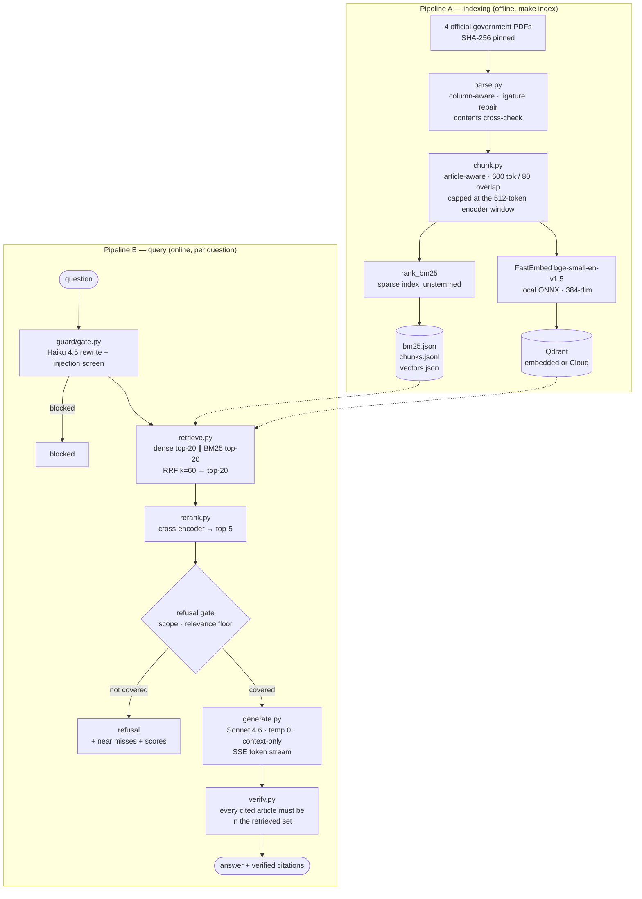

# Lexora

[](https://github.com/Abdr007/lexora/actions/workflows/ci.yml)

**[Live demo → uselexora.vercel.app](https://uselexora.vercel.app)**

The API is a separate deployment on Hugging Face Spaces —
[`/api/health`](https://Abdr007-lexora.hf.space/api/health) ·
[`/api/laws`](https://Abdr007-lexora.hf.space/api/laws) — because the UI is static and the
API needs a container with 1 GB and two ONNX sessions. The image honours `$PORT`, so the
same container runs on Cloud Run unchanged.

> The API sleeps after 48 hours idle and takes ~30 s to wake; the first question of the
> day is slow and the rest are not. Ask it *"What is the capital gains tax rate in
> Singapore?"* to see the refusal path — the part most retrieval demos skip.

**Grounded RAG with two corpora: UAE labour and Dubai tenancy law, or a document you
bring.** Every claim carries the article it came from, every citation opens the exact
clause, and when the indexed law does not cover a question the system says so — and shows
the passages it rejected, with
the scores that rejected them.

Retrieval quality is measured against a 61-question hand-labelled set, not asserted.

```
hit-rate@5   0.913 → 0.935     reranking on/off, same index, same questions
hit-rate@1   0.630 → 0.739
MRR          0.740 → 0.811
refusal      0.333 → 0.800     with zero false refusals on 46 answerable questions
latency      p50 618 ms · p95 765 ms   end to end, CPU only, 30 queries warm
```

The full method, every threshold, and the things that did *not* work are in
[AUDIT.md](AUDIT.md).

## Bring your own document

Drop a contract, a policy, a lease, a photo of a page, or paste a link. The same
retrieval, reranking, refusal gate and citation verification run over it — only extraction
and storage differ.

| | |
|---|---|
| Reads | PDF (text layer **and** scanned), DOCX, images, HTML, plain text, or a URL |
| Scanned pages | OCR — Claude vision when a key is present, Tesseract otherwise |
| Coverage | **100% of every word reaches the index**, asserted per document and in CI |
| Storage | In memory for the session. Never written to disk, dropped when the tab closes |
| Accuracy | Measured on one document — see below. Still not *calibrated* |

Measured over the Dubai tenancy law uploaded through that path, against 12 hand-labelled
questions (`make eval-workspace`): **hit-rate@5 1.000, hit-rate@1 0.750, MRR 0.875,
refusal accuracy 0.750, zero false refusals.** Retrieval scores higher than the corpus
does, which is a smaller haystack rather than an achievement — 13 chunks against 181. The
number worth reading is refusal accuracy: 0.75 against the corpus's 0.80, because the
workspace runs a deliberately permissive floor. One question in four that the document
cannot answer gets answered anyway, bought in exchange for never wrongly refusing one it
can. AUDIT.md §6.7 argues why that trade is right here and wrong as a permanent setting.

**Uploaded documents do not inherit the corpus's numbers, and the API says so.** Every
workspace response carries `calibrated: false`. The refusal floor was fitted against 61
labelled questions about *this corpus*; a document uploaded a minute ago has no labelled
set and no fitted threshold, so the workspace runs a deliberately permissive floor and the
interface states that the accuracy figures were measured against the law library rather
than against your file. Borrowing the corpus's credibility for an un-evaluated document
would be exactly the overclaim this project exists to avoid.

```bash
curl -X POST https://Abdr007-lexora.hf.space/api/workspace/upload -F file=@contract.pdf
# → 201 with a session id on X-Lexora-Session, then ask with {"scope": "workspace"}
```

---

## The two pipelines



**The phrase to remember:** hybrid retrieval because legal queries mix exact terms
("Article 30", "gratuity") that vectors miss with paraphrases ("end-of-service money")
that keywords miss; RRF fuses both, a local cross-encoder reranks, and generation is
grounded with verified citations.

---

## Corpus

Four official English-language publications, fetched by `corpus/download.py` and pinned
by SHA-256. Nothing is generated, paraphrased or synthesised.

| Instrument | Publisher | Articles |
|---|---|---|
| Federal Decree-Law 33/2021 (Employment Relationships), as amended | MOHRE | 74 |
| Cabinet Resolution 1/2022 (implementing regulation) | MOHRE | 39 |
| Law 26/2007 — Landlords and Tenants, Dubai | Government of Dubai | 37 |
| Law 33/2008 — amending Law 26/2007 | Government of Dubai | 13 |
| Decree 43/2013 — Rent Increase, Dubai | Government of Dubai | 4 |

167 articles → **181 chunks**. The PDFs are gitignored; only the manifest of URLs and
digests is committed, so the repo neither redistributes the documents nor trusts a
silently-changed one.

> **Fallback note.** `www.mohre.gov.ae` is unreachable from some networks and
> `uaelegislation.gov.ae` sits behind a bot challenge. `sources.json` therefore carries a
> Wayback Machine `mirror_url` for the affected file — a snapshot of that exact
> government PDF. The mirror is only tried after the official URL fails, the digest is
> enforced either way, and `manifest.json` records which URL actually served the bytes.

---

## Running it

Requires Python 3.12 (via [uv](https://docs.astral.sh/uv/)), Node 20+, and about 1 GB of
disk for the ONNX models.

```bash
make setup          # both toolchains
make corpus         # download + verify the official PDFs
make index          # parse → chunk → embed → Qdrant + BM25
make dev            # API on :7862, web on :3020
```

Open <http://127.0.0.1:3020>. Ports are deliberately not 8000/3000 — those are usually
already taken, and quietly binding a neighbouring project's port is a confusing failure.

### It works with no API key

With no `ANTHROPIC_API_KEY`, Lexora runs in **offline-extractive mode**: retrieval,
fusion, reranking, the refusal gate and citation verification all run and are fully
measurable; answers are quoted verbatim from the corpus instead of being written. Every
response is labelled `offline-extractive` through the API and in the UI, so a number
measured in that mode can never be mistaken for a Claude number.

Adding the key upgrades two stages — the query gate and generation. It does not unlock
any.

| Command | What it does |
|---|---|
| `make check` | every quality gate, exactly as CI runs them |
| `make eval` | retrieval metrics, with and without reranking |
| `make eval-judge` | adds Claude-judged faithfulness and answer relevance |
| `make calibrate` | recompute the refusal floor from the labelled set |
| `make chunking` | re-index at 300/600/1000 tokens and compare |
| `make stop` | stop both services (leaves other projects alone) |

---

## Free deployment

Total cost **$0**. Embeddings and reranking run locally on CPU; Claude is the only paid
API and costs roughly $0.002–0.01 per query.

### API — GCP Cloud Run (always-free tier)

2M requests and 360k GB-seconds per month, forever. `min_instances = 0` so an idle
service bills nothing; the models are baked into the image so a cold start is a model
load rather than a download.

```bash
gcloud auth login
gcloud config set project YOUR_PROJECT
gcloud artifacts repositories create lexora --repository-format=docker --location=europe-west1

make index                                        # the image copies the portable index in
docker build -t europe-west1-docker.pkg.dev/YOUR_PROJECT/lexora/api:latest .
docker push europe-west1-docker.pkg.dev/YOUR_PROJECT/lexora/api:latest

gcloud run deploy lexora-api \
  --image europe-west1-docker.pkg.dev/YOUR_PROJECT/lexora/api:latest \
  --region europe-west1 --allow-unauthenticated \
  --memory 2Gi --cpu 2 --min-instances 0 --max-instances 3 \
  --set-env-vars "LEXORA_CORS_ALLOW_ORIGINS=https://lexora.vercel.app"
```

Or declaratively, which is what `infra/terraform/` is for:

```bash
cd infra/terraform
terraform init
terraform apply -var project_id=YOUR_PROJECT -var image=IMAGE_URL
```

The Terraform module provisions the Cloud Run service, a dedicated service account, and
the Anthropic key in Secret Manager — and sets the three knobs (`min_instances`,
`memory`, `max_instances`) that actually decide whether this stays inside the free tier.

### A note on the host: this needs 1 GB

Measured, not estimated. In a container the service peaks at **524 MB** — onnxruntime's
allocators and the two model sessions do not share the host's page cache, so host RSS
(155 MB) badly understates it. At a 512 MB cap it is OOM-killed, and thread-count, arena
and malloc-trim tuning do not close the gap. Details and the full table in
[AUDIT.md §6.4](AUDIT.md).

That rules out the 512 MB free tiers — Render's included. The alternative host is a
Hugging Face **Docker** Space ([infra/DEPLOY-SPACES.md](infra/DEPLOY-SPACES.md)), which
has the RAM but now requires a PRO subscription. Cloud Run's always-free allowance covers
this workload at 2 GB, so it is the recommended target. The image is identical either
way: the entrypoint honours `$PORT` when one is injected and falls back to 7860.

### Web — Vercel

```bash
cd apps/web && npx vercel --prod
```

Set `NEXT_PUBLIC_API_URL` to the Cloud Run or Spaces URL, then add that origin to
`LEXORA_CORS_ALLOW_ORIGINS` on the API. CORS is an allowlist, never `*`.

### Qdrant and Langfuse

Both optional. Unset, Qdrant runs embedded on disk with no account and no credentials.
Set `LEXORA_QDRANT_URL` + `LEXORA_QDRANT_API_KEY` to use the Cloud free tier (1 GB — this
corpus needs a few megabytes). Langfuse traces every model call when its keys are set,
and is a no-op when they are not; a tracing failure can never fail a request.

---

## Layout

```
lexora/
  apps/api/            FastAPI service (Python 3.12)
    app/rag/           parse · chunk · index · retrieve · rerank · generate · verify
    app/guard/         query rewrite + prompt-injection screening
    app/core/          settings · models · claude · embedding · vectorstore · observability
    tests/             189 tests, run against the real corpus and index
  apps/web/            Next.js 15 · Tailwind 4 · Framer Motion
  corpus/              download.py + provenance manifest (PDFs gitignored)
  eval/                questions.jsonl · ragas_run.py · chunking_experiment.py
  Dockerfile           API image (Cloud Run + HF Spaces)
  infra/               terraform/ · deploy guides
  AUDIT.md             every check, every measurement, every accepted residual
```

---

## What is worth reading in the code

- **`app/rag/parse.py`** — the corpus fights back. A two-column layout, a font whose
  `Th` ligature maps to a bare `T`, a definitions table that inverts on sub-pixel
  coordinates, and one article whose heading the government simply forgot to print. Each
  defect was found by measurement and is fixed with evidence, not a guess.
- **`app/rag/rerank.py`** — bi-encoder versus cross-encoder, and the refusal gate that
  rides on the cross-encoder's scores.
- **`app/rag/scope.py`** — the finding that topical relevance is not legal
  applicability, and why no similarity score can close that gap.
- **`app/rag/verify.py`** — why a fabricated citation is flagged rather than deleted.
- **`AUDIT.md`** — including the two approaches that were measured and rejected.
